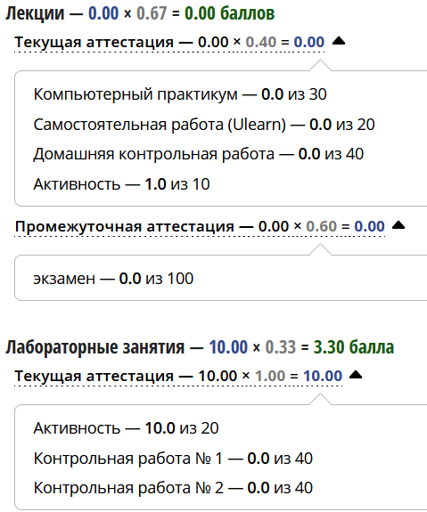
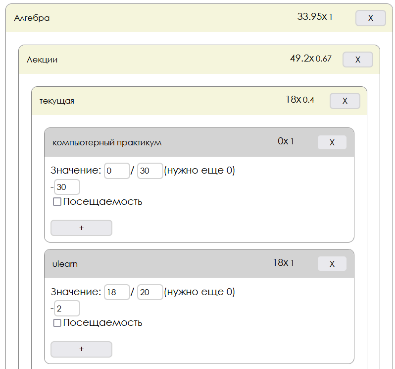
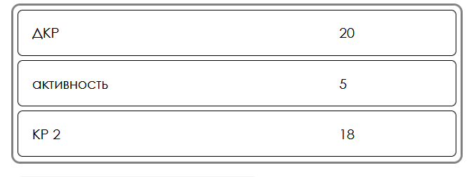

# BRS freak
Калькулятор для балльно-рейтинговой системы

## Идея
Позволяет с помощью коэффициентов, по которым формируется оценка, определить,
сколько баллов по каждому виду работ нужно получить, чтобы набрать нужный балл.

## Лирика
Представьте себе студета. Он не хочет ходить на пары и писать работы, однако, 
чтобы не вылететь из ВУЗа ему нужно получать баллы. 
К сожалению, учебное заведение студента исользует довольно замысловатые схемы 
формирования
оценок - множество разных коэффициентов для разных видов активностей.

К счастью, если знать формулу для оценки по предмету, можно не только 
посчитать саму эту оценку, но и вычислить, по каким заданиям нужно набрать
ещё баллы.

Так, BRSfreak позволяет ленивому студенту заранее узнать сколько баллов
по каждому виду работ ему нужно получить, чтобы, например, закрыть сессию,
или (если задать такую цель) получить "отлично" в семестре.

| Так вуз показывает баллы студент | а вот так - редактор BRSfreak                |
|----------------------------------|----------------------------------------------|
|             |  |
В результате сервис пишет, сколько баллов нужно набрать по кажному заданию:

## Запуск и сборка
`npm start` - запуск локально

`npm run build` - сборка проекта
